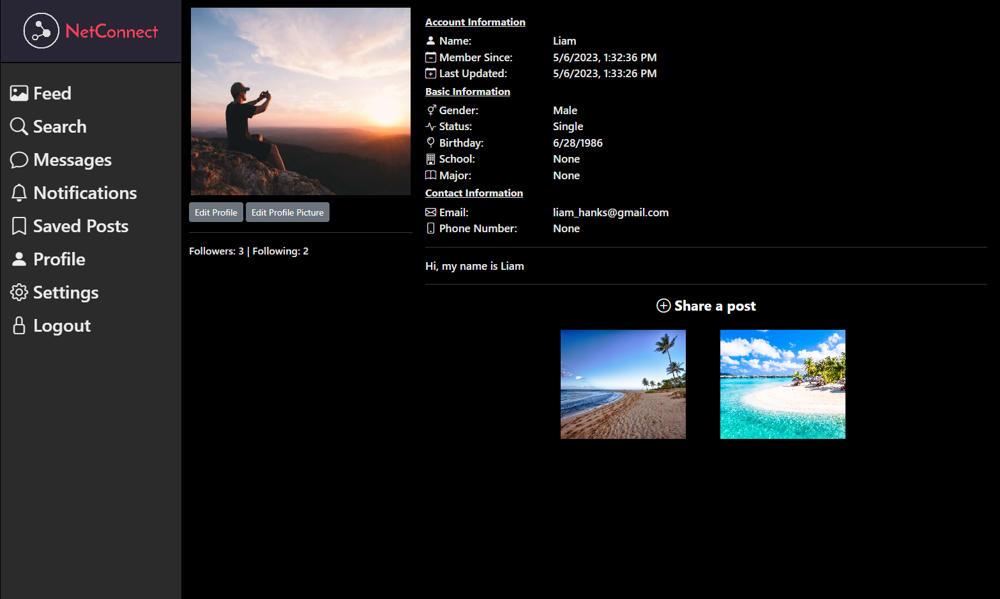
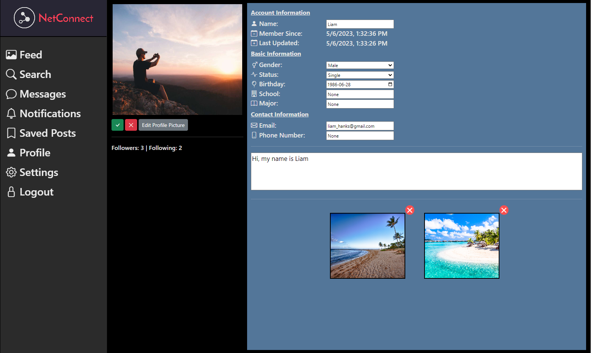
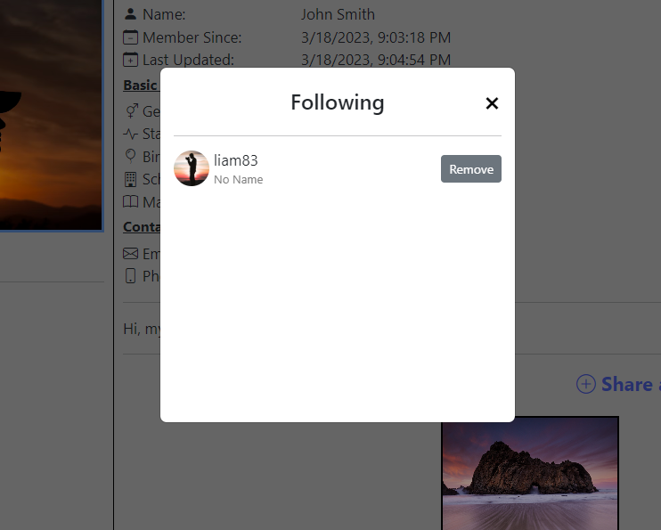

# Social Networking Site
This site gives you the ability to create your own page, having your information for other 
users on the network to see, allowing them to follow and message you directly. Frontend written in React.JS and backend NodeJS.

 
 
 

# Requirements
- NPM & NodeJS
- Web Hosting Software (example: nginx, xampp) for client
- Enable Read & Write for Server folder: sudo chmod -R 777 /var/www/html/

# Usage
- npm install
- npm run build
- node server.js (run server)
