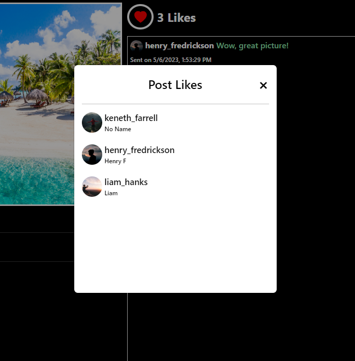

# Social Networking Site
Built using: React.JS | Node.JS | PostgreSQL

- User Registration and Login:
  - Users can create accounts by registering with their email or social media profiles.
  - Secure login system ensures privacy and data protection.

- Profile Management:
  - Users have personalized profiles that they can edit and customize.
  - Profile information includes bio, profile picture, and other details.

- Friend Connections:
  - Users can search for and connect with friends on the platform.
  - The option to follow friends allows users to stay updated with their activities.

- Messaging System:
  - Users can send direct messages to their friends within the platform.
  - Private conversations provide a seamless communication experience.

- Photo Sharing:
  - Users can upload and share photos with their friends and followers.
  - A user-friendly interface allows for easy browsing and viewing of shared pictures.

- Profile and Post Viewing:
  - Users can explore other people's profiles and view their posts.
  - User-friendly navigation enables effortless browsing through different profiles.

- Notifications:
  - Users receive real-time notifications for friend requests, messages, and likes/comments on their posts.
  - Notifications keep users engaged and informed about the platform's activities.

- Post Saving:
  - Users have the option to save interesting posts for later reference.
  - Saved posts can be accessed from a dedicated section within the user's profile.

- Account Settings:
  - Users can customize their account settings to suit their preferences.
  - Options include privacy settings, notification preferences, and personalization choices.

## Profile
 
 

## Connections
 
 

## Profile Options
 

## Messaging
 

## Notifications
 

## User Search
 

## User Settings
 

## Your Saved Posts
 

## Your Feed
 

## Post
 
 
 

# Requirements
- NPM & NodeJS
- PostgreSQL
- Nginx Web Server (recommended)
- Enable Read & Write for Server folder: sudo chmod a+rwx -R /var/www/html/

# Working Versions
- Node v18.12.1
- NPM v8.19.2

# Usage
- npm install
- npm run build
- node server.js (run server)
- Execute database file 'netconnect.sql' in postgres (\i netconnect.sql)
- Rename 'example.env' to '.env' and change variables based on your own

# React Routing - Config Changes for Nginx
- Modify /etc/nginx/sites-available/default
- location / { try_files $uri /index.html; }