# Social Networking Site
This site gives you the ability to create your own page, having your information for other 
users on the network to see, allowing them to follow and message you directly. Frontend written in React.JS and backend NodeJS.

## Profile
 
 

## Connections
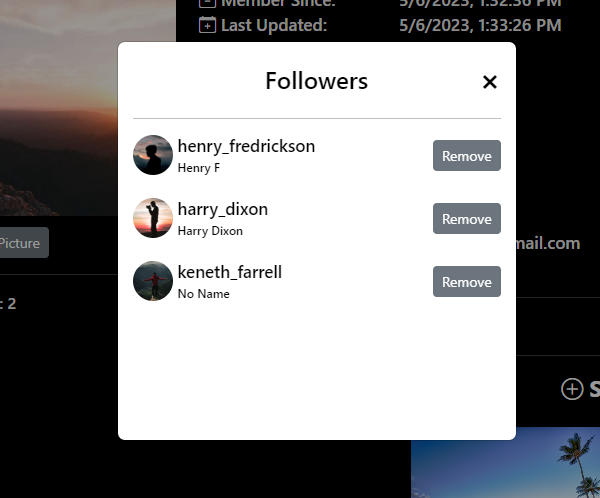 
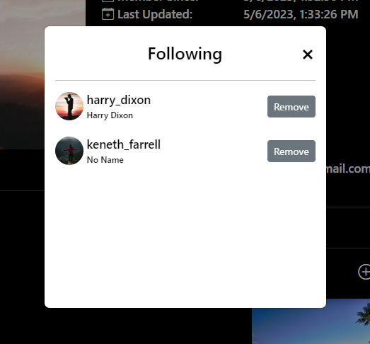 

## Profile Options
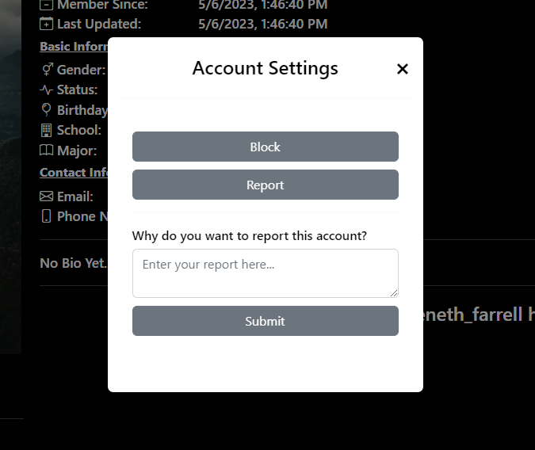 

## Messaging
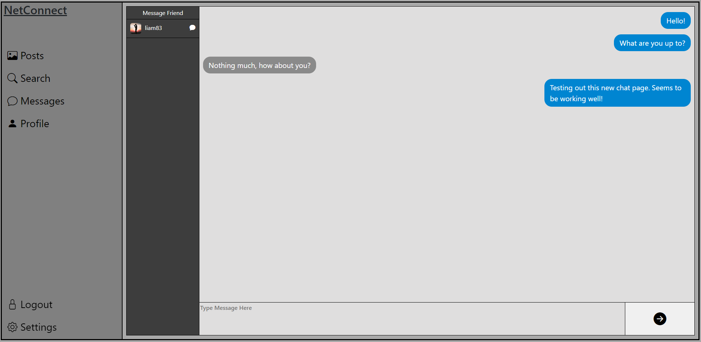 

## Notifications
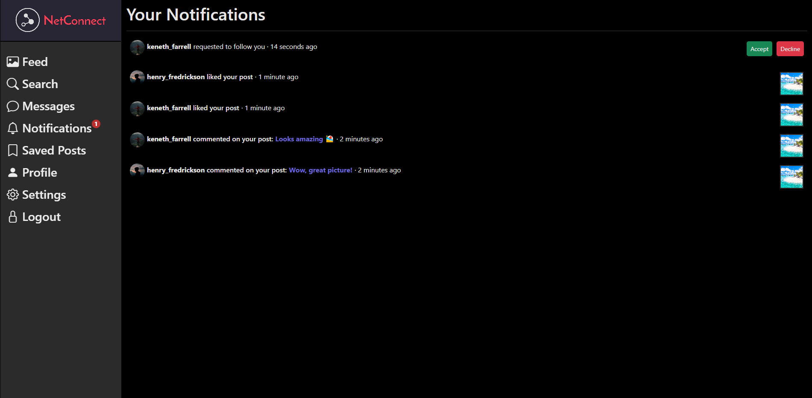 

## User Search
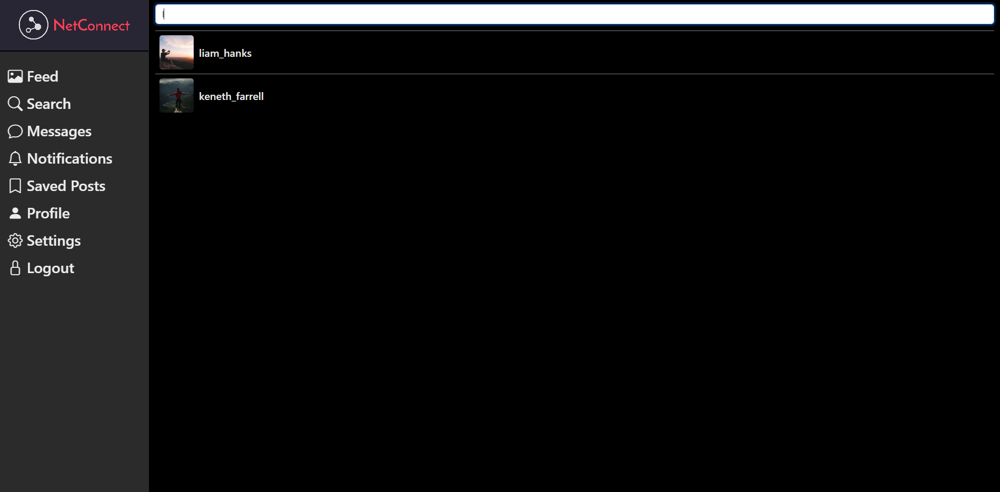 

## User Settings
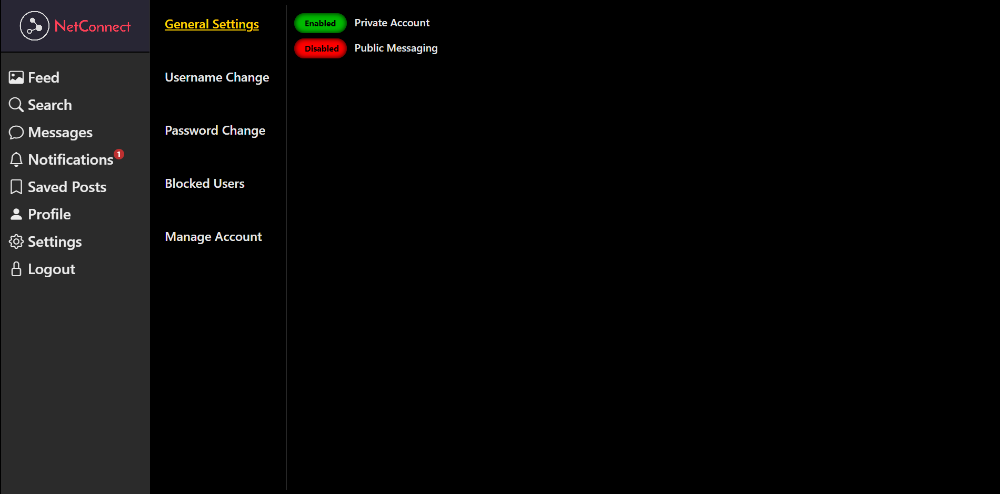 

## Your Saved Posts
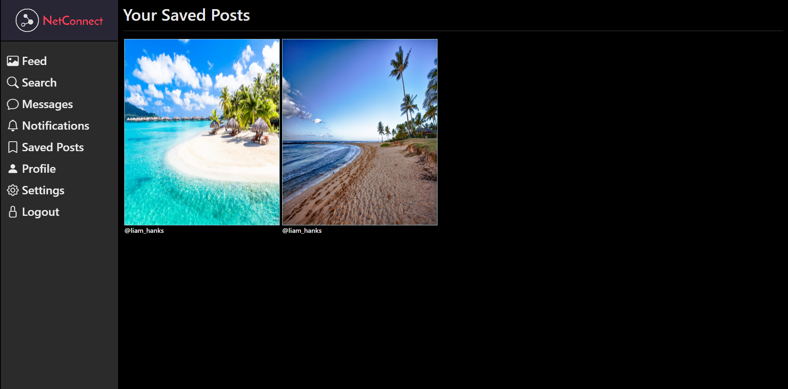 

## Your Feed
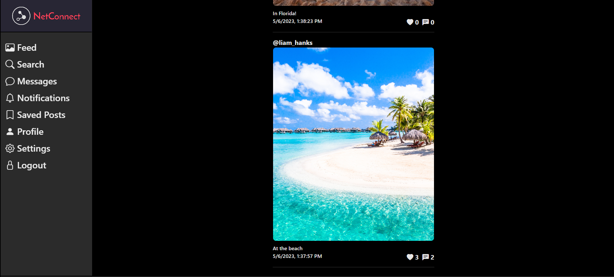 

## Post
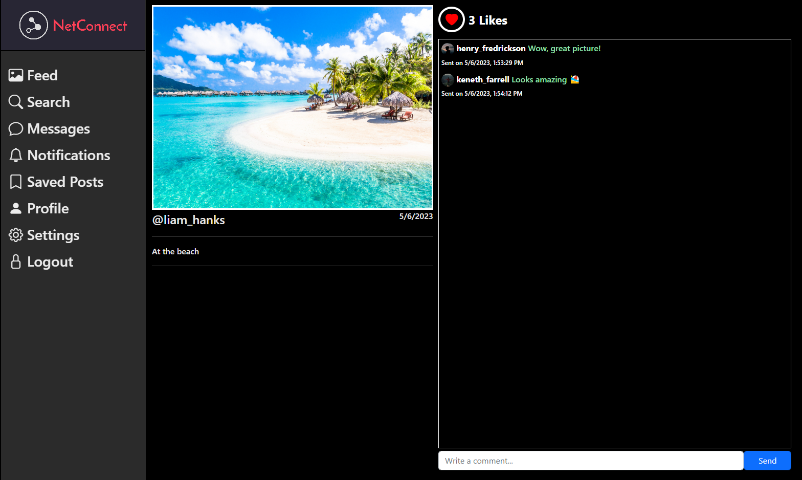 
 
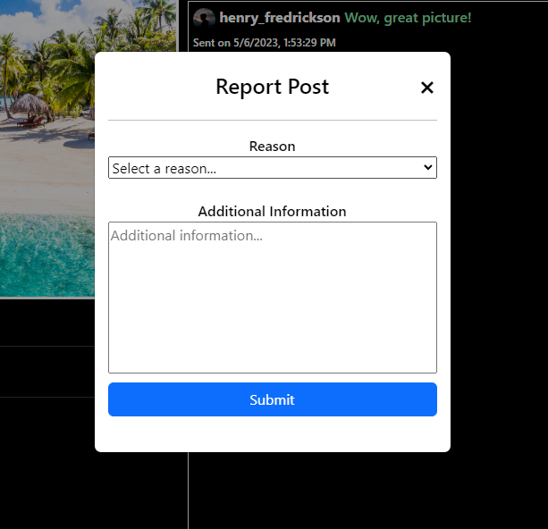 

# Requirements
- NPM & NodeJS
- PostgreSQL
- Nginx Web Server (recommended)
- Enable Read & Write for Server folder: sudo chmod a+rwx -R /var/www/html/

# Working Versions
- Node v18.12.1
- NPM v8.19.2

# Usage
- npm install
- npm run build
- node server.js (run server)
- Execute database file 'netconnect.sql' in postgres (\i netconnect.sql)
- Rename 'example.env' to '.env' and change variables based on your own

# React Routing - Config Changes for Nginx
- Modify /etc/nginx/sites-available/default
- location / { try_files $uri /index.html; }