# Social Networking Site
Built using: React.JS | Node.JS | PostgreSQL

## Profile
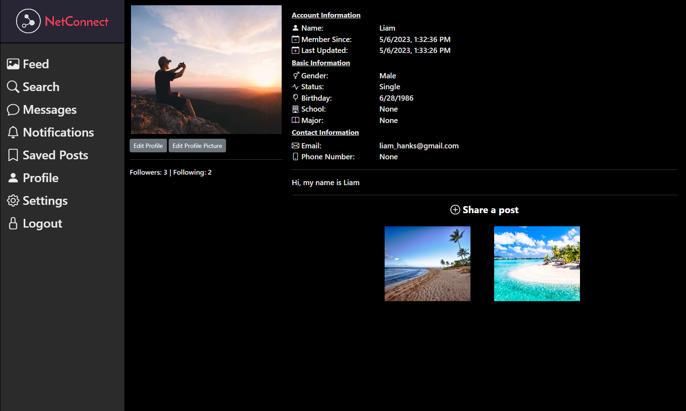 
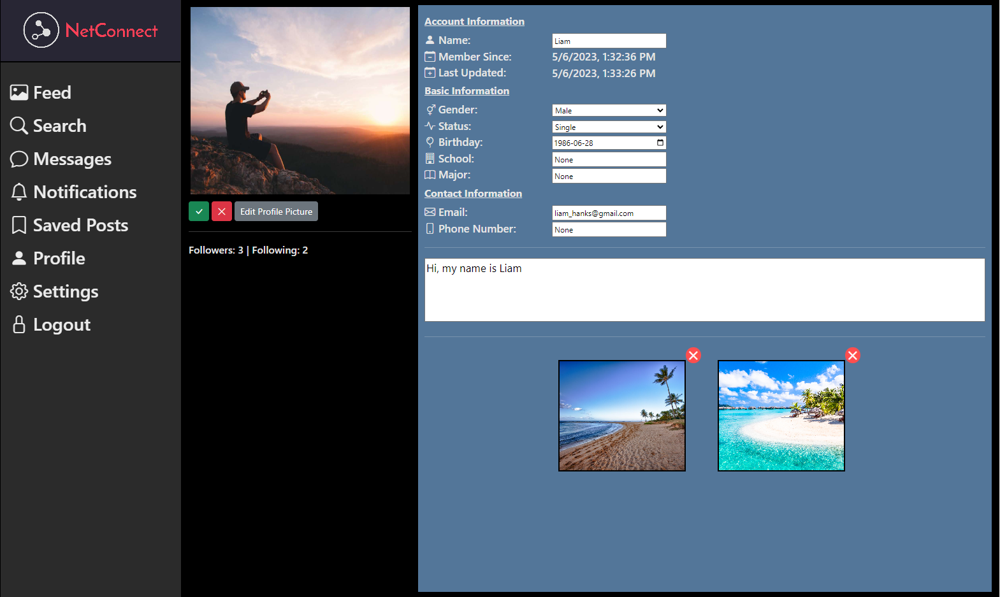 

## Connections
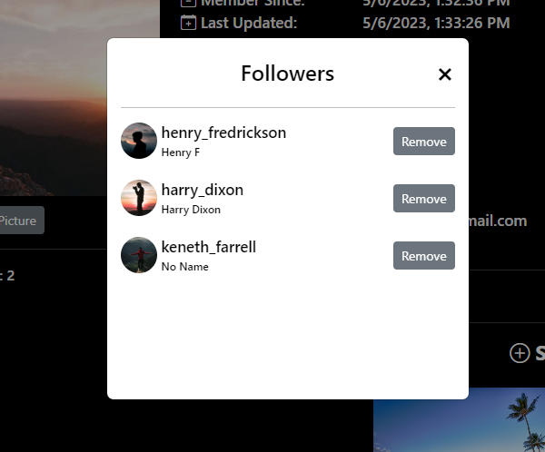 
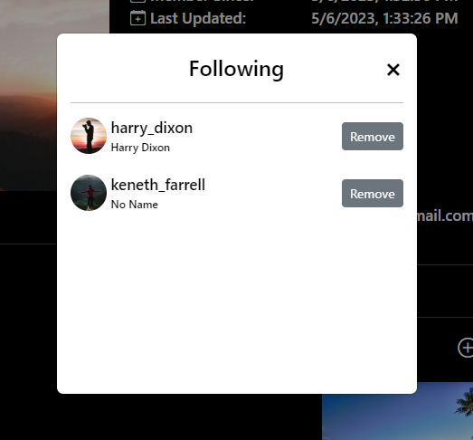 

## Profile Options
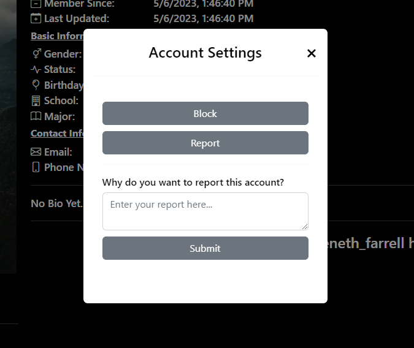 

## Messaging
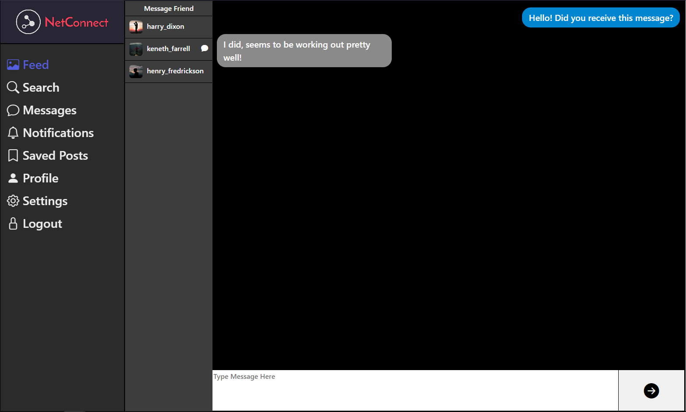 

## Notifications
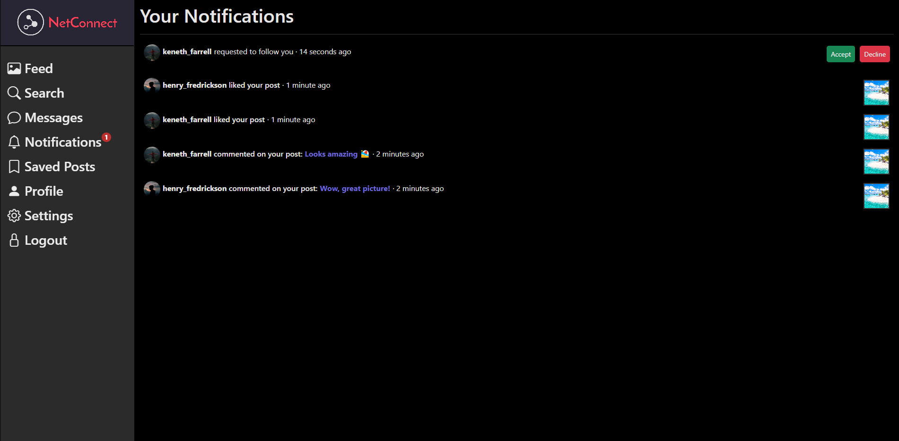 

## User Search
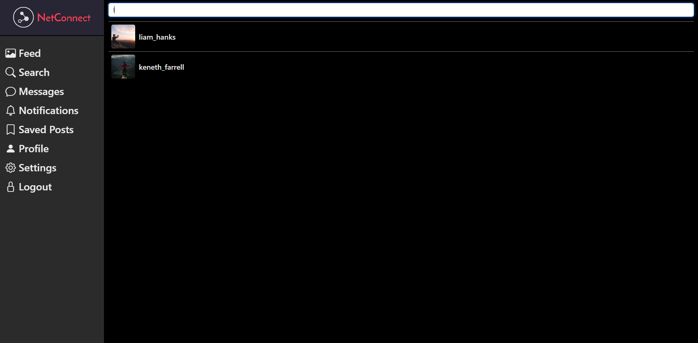 

## User Settings
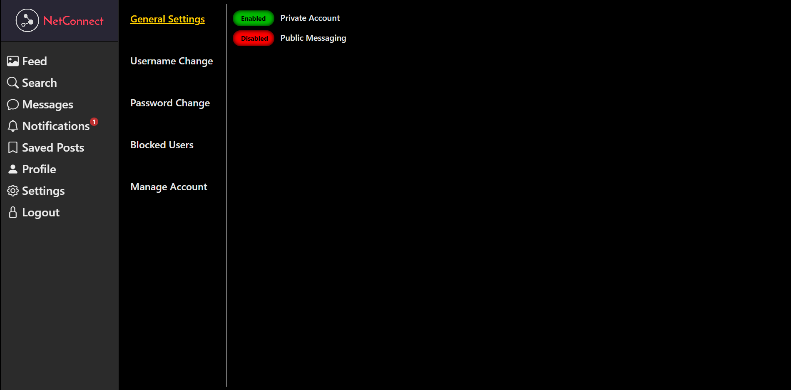 

## Your Saved Posts
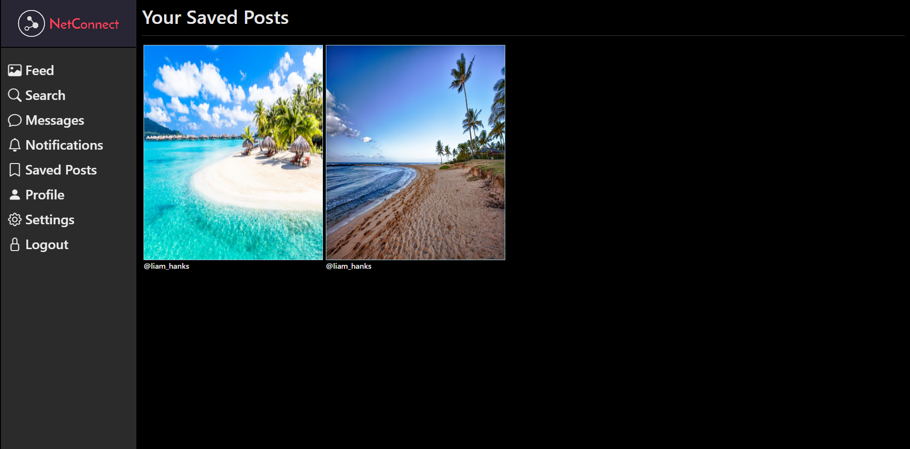 

## Your Feed
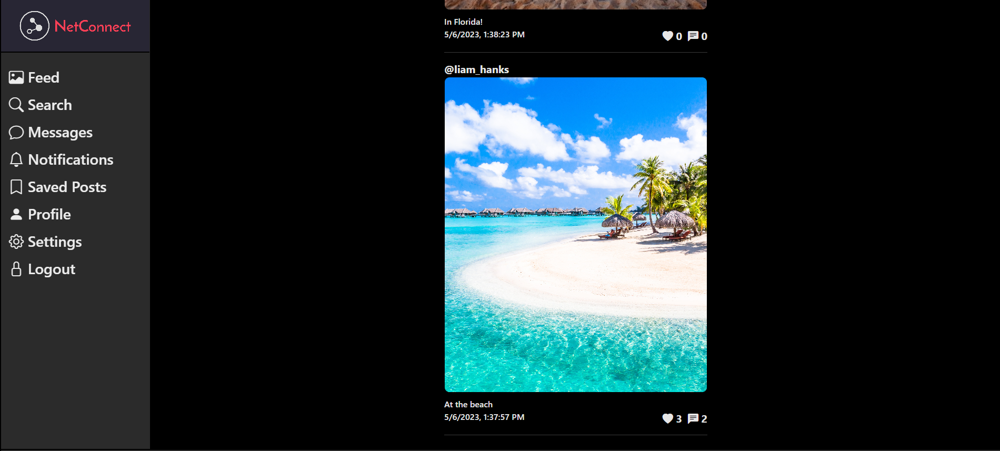 

## Post
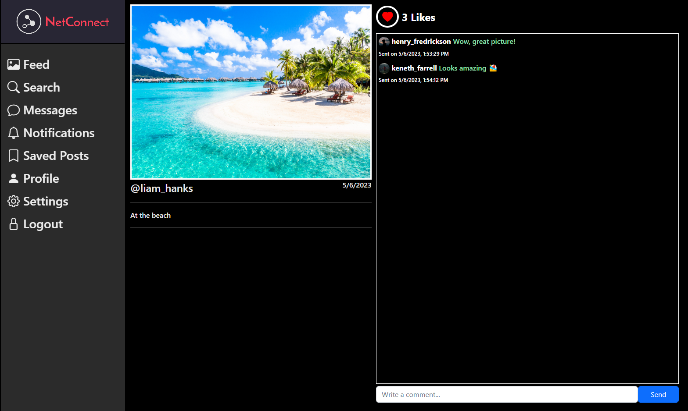 
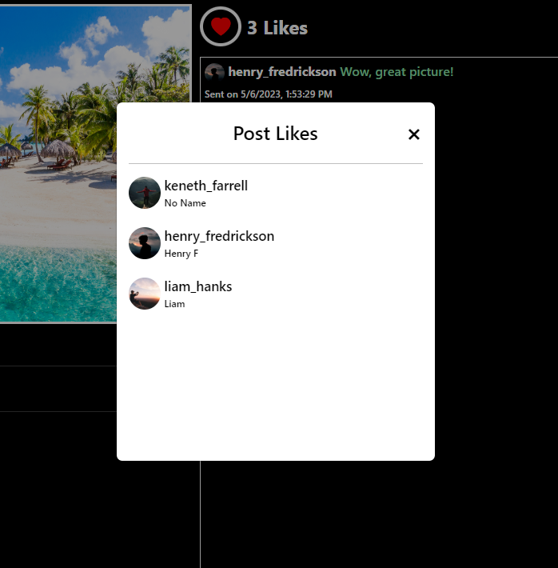 
 

# Requirements
- NPM & NodeJS
- PostgreSQL Database
- Nginx Web Server

# Working Versions
- Node v18.12.1
- NPM v8.19.2

# Frontend Usage
- npm install
- npm start

# Backend Usage
- npm install
- Execute database file 'netconnect.sql' in PostgreSQL (\i netconnect.sql)

# Main API Usage
- node server.js

# File Server API Usage
- node file-server.js
- Ensure Read/Write are permitted on the 'content' folder

# Chat Server API Usage
- node chat-server.js